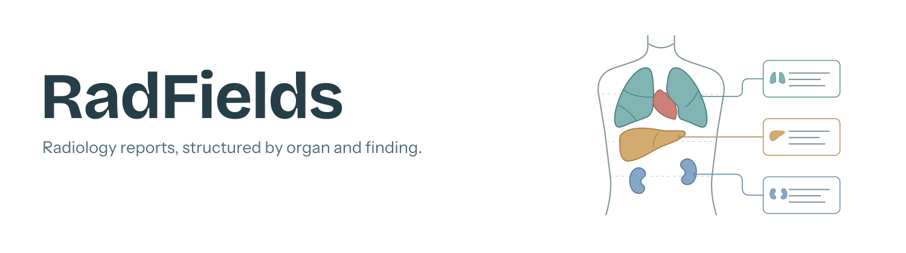

<picture>
  <source media="(prefers-color-scheme: dark)" srcset="img/banner-dark.svg">
  
</picture>

RadFields is a library for making archives of narrative radiology reports more accessible, by mapping free text onto structured templates at scale. Each given report is processed in two steps. Template selection comes first: the library identifies the examination performed, then picks the templates that fit based on the main questions or diagnoses reported. Structuring follows, pulling the text spans that describe individual findings for each organ (system) into the selected templates. Prompts and template fields are in German.

## How it works

1. **Template Selection:** `StructuredReportGenerator.select_templates` classifies the provided report according to imaging modality, examined body regions / organ systems and main questions / diagnoses, yielding a set of suitable structuring templates or identifying a report stub / rare examination.
2. **Structuring:** `StructuredReportGenerator.structure_report` extracts the report content into the fields of the previously determined structuring templates.

The library supports **Ollama** and **OpenAI-compatible endpoints**. Inference requires a running backend and a model that supports JSON-schema structured output; compatibility depends on the server and model configuration.

The [German template collection](templates/de) covers CT, MRI, ultrasound, X-ray, and interventional radiology. YAML files define nested report sections; the library converts these into Pydantic schemas for structured model responses. Template hints guide extraction but do not establish clinical correctness.

## Installation

Use **Python 3.12 or newer**. Install from a checkout so that templates and supporting data are available alongside the code:

```bash
git clone https://github.com/fputtkammer/RadFields.git
cd RadFields
python3 -m venv .venv
source .venv/bin/activate
python -m pip install -e .
```

## Working with reports

Import `StructuredReportGenerator` from `rad_fields.generator`. Initialize it with `template_index_path="templates/de/template_index.yaml”`,  `combined_exams_path="templates/de/combined_exam_definitions.yaml"` and your `model_name`; Ollama is the default backend. For an OpenAI-compatible endpoint, also supply `api="openai"`, `base_url`, and `api_key`.

Call `select_templates(report_text)` first. Then pass the value for the `template_names` key of the returned dictionary to `structure_report(report_text, template_names)`. A single template produces a JSON string; multiple templates produce a list of JSON strings. In case the LLM indicates that a report contains no findings or has no matching template option an exception is raised.

A simple demonstration script can be found at scripts/structure_reports_simple.py.

To customize the structure, edit the YAML files and their [template index](templates/de/template_index.yaml). Paths in the index resolve relative to that file.

## Tests

```bash
python -m pip install -e '.[test]'
python -m pytest --ignore tests/integration
```

The default suite uses mock LLMs and needs no inference server. Run `python -m pytest tests/integration` separately with the Ollama models required by those tests available.

## Citation and license

The accompanying manuscript is not yet published. Paper citation details will be added when available.

The code is distributed under the [MIT license](LICENSE.txt). Report bugs through [GitHub Issues](https://github.com/fputtkammer/RadFields/issues).
